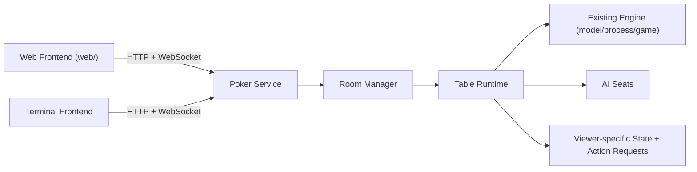

# Poker Web Console Design

## Summary

为当前 `poker` 仓库设计一个长期运行的扑克服务和仓库内前端体系。第一版目标是让浏览器连接到一个持续运行的服务，完成建房、入座、观战、开局、网页内打牌和查看实时状态；同时保留 terminal 前端，使用 `cmd/pokerctl/` 作为入口，接入同一套服务协议，而不是继续直接驱动本地游戏循环。

第一版明确支持：

- 单服务进程
- `web/` 目录中的浏览器前端
- `cmd/pokerctl/` 终端前端接入同一服务
- 一个真人座位，其余座位由 AI 填充
- 观战
- 房间级实时状态推送

第一版明确不支持：

- 多真人同时入座
- 账号体系
- 房间持久化
- 历史回放
- 复杂拖拽筹码交互

## Goals

- 提供一个长期运行的服务进程，作为房间和牌局状态的唯一持有者。
- 提供仓库内的 Web 前端，覆盖大厅、房间和牌桌操作面。
- 让网页用户可以直接完成 `bet`、`call/check`、`fold`、`all-in`。
- 让观战者实时看到脱敏后的房间状态和事件流。
- 让 `cmd/pokerctl/` 成为共享服务协议的一类前端，而不是保留旧的本地直连流程。
- 为后续扩展到多真人在线保留清晰边界。

## Non-Goals

- 第一版不做多真人并发行动。
- 第一版不做用户登录、权限系统、排行榜。
- 第一版不做数据库或服务重启后的房间恢复。
- 第一版不做牌谱回放、导出、重播。
- 第一版不做复杂的视觉特效或赌场主题装饰层。

## Visual Direction

### Visual Thesis

深色、克制、偏操作台气质的扑克控制台，重点靠牌面、桌面布局、状态灯和排版建立氛围，而不是靠大量卡片、金色描边或博彩装饰。

### Content Plan

- Hero replacement: 大厅工作面本身就是首屏，不单独做营销 hero。
- Support: 房间列表与创建房间动作。
- Detail: 房间页内的牌桌、状态、事件流、操作区。
- Final CTA: 入座、开始新一局、提交动作。

### Interaction Thesis

- 进入房间时，牌桌和座位分层淡入，先建立空间感。
- 当前操作者座位和底部动作条同步高亮，强化轮转感。
- 公共牌揭示和结算结果使用短促、明确的状态过渡，而不是长动画。

## System Architecture

系统拆为一个共享服务内核和两个前端适配器。

- `cmd/pokerd/`: 长期运行的扑克服务入口。
- `internal/service/`: 房间管理、会话管理、入座、观战关系。
- `internal/table/`: 牌桌运行时，负责把现有 `model/process/game` 包装成可等待人类动作的流程。
- `internal/api/`: HTTP 接口和 WebSocket 推送层。
- `web/`: React + TypeScript 前端。
- `cmd/pokerctl/`: 终端前端入口。

核心边界：

- 房间是状态所有者。
- 每个房间只允许一条串行事件流推进状态。
- 各前端只读取按视角脱敏后的快照。
- 所有会改变牌局状态的动作都经过服务校验。

## Runtime Model

每个房间由一个独占 goroutine 管理，避免多前端或异步 AI 让牌局状态交错。

房间状态机：

- `waiting`: 房间已创建，尚未开局。
- `running`: 牌局正在推进，AI 可自动行动。
- `awaiting_action`: 当前轮到人类座位，服务暂停并等待动作提交。
- `hand_finished`: 单局结束，等待下一局。
- `closed`: 房间关闭或整体结束。

推荐模型不是让前端驱动整局，而是让服务推进整局，并在轮到真人时进入一个受控等待点。AI 和人类 seat 的行为差异如下：

- AI seat: 服务内部直接计算动作并继续推进。
- Human seat: 服务创建一个 `pending_action`，生成 `action_token`，并等待客户端提交动作。
- Viewer: 只接收状态更新和事件流，不可提交动作。

这个模型允许继续复用现有同步阻塞式 `Interact()` 思路，但把人类输入改成服务级等待，而不是直接读取 stdin。

## Engine Adaptation

现有 `process/process.go` 与 `model/board.go` 提供了完整的对局循环与脱敏复制逻辑，但当前实现默认交互对象是进程内同步 `Interact()`。

第一版需要增加一层适配：

- 把“人类交互”从终端输入替换为“等待服务层动作提交”。
- 保留现有发牌、轮次推进、结算、AI 行为逻辑。
- 保留并复用 `DeepCopyBoardToSpecificPlayerWithoutLeak` 作为视角脱敏基础。
- 让牌桌运行时显式暴露“当前待处理动作请求”，而不是把这个状态隐含在阻塞调用里。

适配后的 table runtime 需要负责：

- 初始化房间牌桌和 seat 配置。
- 推进完整一局。
- 在真人轮次挂起并等待动作。
- 为 Web 和 `cmd/pokerctl/` 生成统一的房间快照。
- 广播事件流，例如盲注、下注、翻牌、结算。

## Frontend Information Architecture

`web/` 第一版不做品牌官网，直接做产品工作面。

### Lobby Page

职责：

- 展示当前房间列表
- 创建房间
- 进入房间
- 恢复最近查看的房间

展示字段：

- 房间名
- 状态
- 小盲
- 当前手数
- 座位占用情况
- 是否已有真人入座

### Room Page

职责：

- 显示牌桌主视图
- 显示房间顶部状态栏
- 显示事件流
- 显示当前用户的可执行操作
- 支持观战与入座切换

布局：

- 顶部：房间信息、连接状态、身份状态、离开房间、开始下一局
- 中央：椭圆牌桌、公共牌、底池、六个固定座位
- 底部：当前玩家手牌和动作条
- 右侧：事件流和轻量调试信息

### Terminal Frontend

`cmd/pokerctl/` 作为同一协议的轻客户端存在，覆盖：

- 查看房间列表
- 进入房间
- 观战
- 提交动作
- 查看当前快照和事件流

它不再直接调用现有本地 `PlayPoker()` 流程。

## Table UI Rules

牌桌 UI 必须遵守以下规则：

- 六个座位固定排布，避免第一版引入可变座位布局。
- 当前操作者座位必须有明确 turn ring。
- 我方手牌固定贴底显示。
- 空座位、AI、真人、弃牌、all-in 必须在座位视觉上立即可辨识。
- 操作区只显示当前合法操作，不展示误导性按钮。
- 事件流文本以操作信息为主，不做营销式文案。

第一版避免：

- Hero 卡片
- SaaS 卡片拼盘式大厅
- 复杂拖拽筹码
- 过重的霓虹或赌场视觉装饰

## Network Contract

通信分两层：

- HTTP 负责状态变更请求
- WebSocket 负责实时状态和事件推送

### HTTP Responsibilities

- 创建房间
- 列出房间
- 进入房间
- 以真人身份入座
- 开始首局或下一局
- 提交动作
- 离开房间

建议的第一版路由骨架：

- `GET /api/rooms`
- `POST /api/rooms`
- `GET /api/rooms/{roomID}`
- `POST /api/rooms/{roomID}/seat`
- `POST /api/rooms/{roomID}/spectate`
- `POST /api/rooms/{roomID}/start`
- `POST /api/rooms/{roomID}/actions`
- `POST /api/rooms/{roomID}/leave`

### WebSocket Responsibilities

- 推送房间列表变化
- 推送房间快照
- 推送 `pending_action`
- 推送事件流
- 推送结算结果
- 推送连接与房间状态变化

第一版所有动作请求都必须带上当前 `action_token`。服务只接受：

- 正确房间
- 正确座位
- 正确 token
- 合法金额与动作组合

重复提交、过期 token、非当前玩家提交都必须稳定拒绝。

## Room Snapshot Model

前端消费的是带版本号的房间快照，而不是自行拼装事件结果。

房间快照至少包含：

- 房间基础信息
- 房间生命周期状态
- 当前手数
- 当前回合
- 当前底池、当前金额、小盲
- 公共牌
- 六个座位的公开状态
- 当前查看者身份
- 如果当前查看者是人类玩家，则包含其私有手牌
- 如果当前正在等待动作，则包含当前 `pending_action` 描述
- 最近事件流
- 快照版本号

视角脱敏规则：

- 真人玩家只看到自己的手牌和已公开公共牌。
- 观战者只看到公开信息。
- AI 不通过前端协议读取状态。

## Error Handling

第一版错误处理策略如下：

- WebSocket 断开后，前端重连先拉最新快照，再恢复订阅。
- 服务不保证补发完整事件历史，前端以最新快照为准。
- 房间已关闭、房间不存在、座位已被占用、非当前轮次提交动作、金额非法，这些都返回稳定业务错误。
- 当前真人掉线或超时，服务自动执行保底动作：能 `check` 则 `check`，否则 `fold`。
- 服务重启后房间丢失，前端显示房间失效，不做自动恢复。

## Testing Strategy

实现时至少覆盖四层验证：

### Engine Adaptation Tests

- 等待真人动作的挂起逻辑
- AI 自动推进逻辑
- 按视角脱敏后的快照生成

### Room Runtime Tests

- 建房
- 真人入座
- 观战
- 开始新一局
- 超时自动动作
- 重复提交和过期 token 拦截

### API Integration Tests

- HTTP 路由行为
- WebSocket 推送顺序
- 从建房到单局结算的一条完整流程

### Frontend Tests

- 大厅页渲染
- 房间页渲染
- 动作条合法状态切换
- 一条端到端流程：建房 -> 入座 -> 打一手牌 -> 看到结算

## Implementation Constraints

- 前端代码全部放在仓库内 `web/`。
- 允许引入独立前端构建链，推荐 `Vite + React + TypeScript`。
- Go 服务仍是主进程与部署入口。
- 不在第一版引入数据库。
- 不在第一版引入多租户或鉴权复杂度。

## Risks And Mitigations

### Risk: Current engine assumes local synchronous human input

Mitigation:

- 在 `internal/table/` 里引入等待点和动作提交适配层，不直接把 Web 逻辑塞进现有 `process` 包。

### Risk: Frontend state drifts from service state

Mitigation:

- 前端只信任带版本号的房间快照。
- 写操作全部走 HTTP，WebSocket 只做广播。

### Risk: Future multiplayer expansion becomes blocked

Mitigation:

- 第一版就把房间、seat、会话和视角脱敏做成共享协议，不把 Web UI 和单人假设写死在引擎里。

## Recommended Build Sequence

推荐实现顺序：

1. 建立共享服务入口和房间运行时骨架。
2. 把当前人类交互改造成服务等待点。
3. 定义房间快照和 `pending_action` 协议。
4. 搭建 HTTP + WebSocket API。
5. 搭建 `web/` 大厅页和房间页。
6. 增加 `cmd/pokerctl/` 轻客户端以复用同一协议。
7. 补 API、运行时和前端测试。

## Open Future Extensions

这些方向为后续版本预留，但不纳入第一版：

- 多真人同时入座
- 用户身份与房间权限
- 房间持久化与服务重启恢复
- 历史牌局回放
- 牌局导出与统计面板
